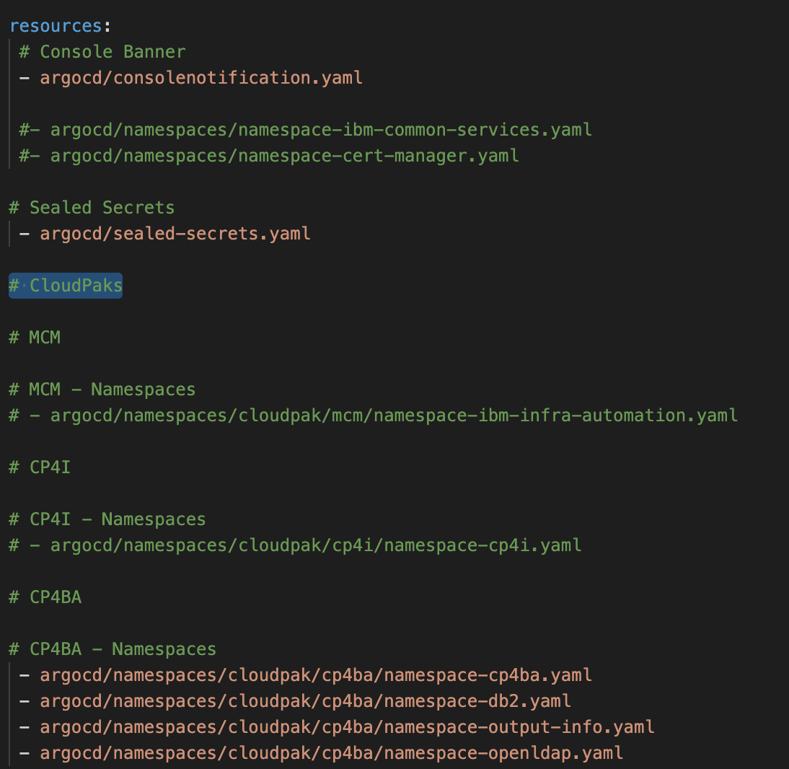
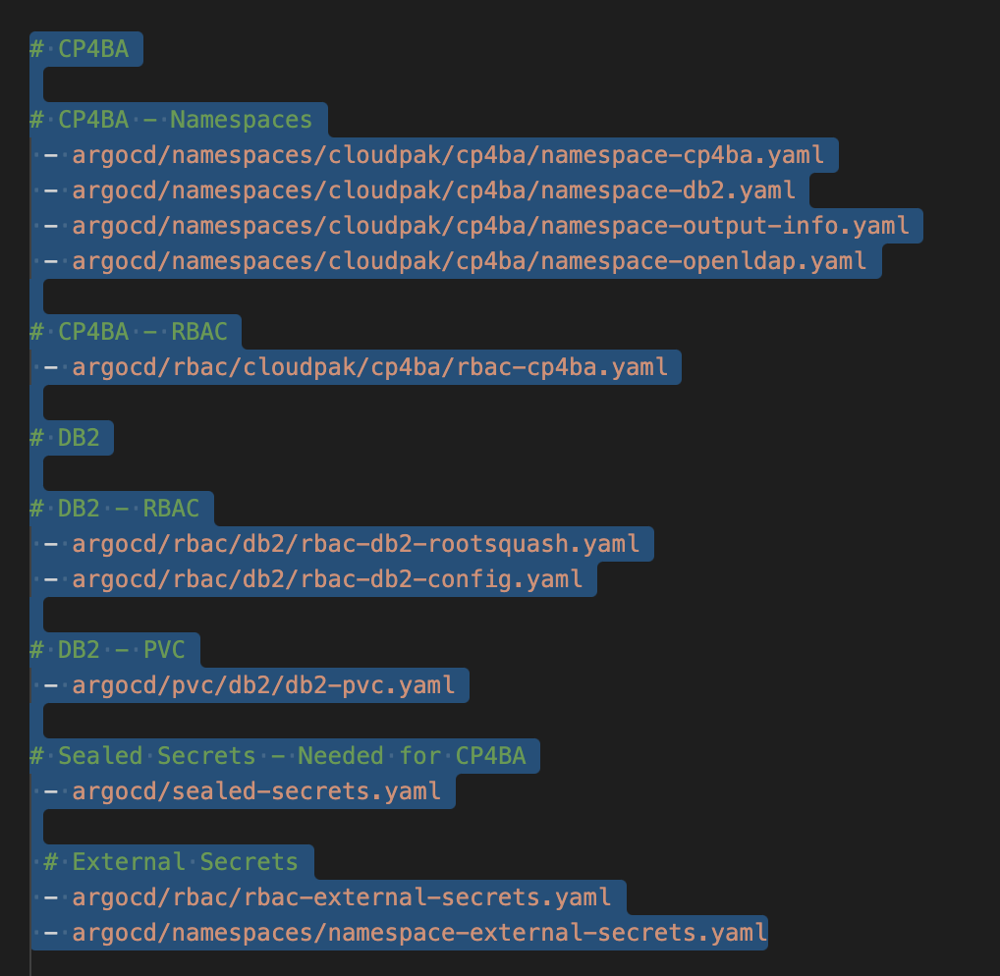

# Catalog of Infrastructure Resources

This git repository serves as a library of infrastructure related and clusterwide resources for the [One Touch Provisioning](https://github.com/one-touch-provisioning/otp-gitops) asset.  The resources are plain YAMLs or YAMLs pacakged as a Helm Chart and can be referenced by ArgoCD Applications.  

The Charts are hosted in the [Cloud Native Toolkit Helm Repository](https://github.com/cloud-native-toolkit/toolkit-charts).

## CP4BA - FileNet and IER assets

The assets deployed are defined in the **kustomization.yaml** file found in the **0-bootstrap/hub/1-infra/kustomization.yaml** directory in the [parent repository](https://github.com/oto-gitops-oneshot/otp-gitops). The file is laid out in a manner to make it clear what components are relevant for this use case.

First and foremost, we do plan to extend this framework to support other Cloud Paks as well. The "CloudPaks" heading should make this apparent, therein lies the different cloud paks, for instance CP4I and CP4BA.

Scroll down a tad and divert your attention to the CP4BA heading, along with the list of the enclosed services, as shown below.

All the namespaces, roles, bindings, operators and pvc's required to stand up CP4BA are defined here.

## Action points

Action points moving forward are given in the following subsections.

### Action points - DB2

You would have noted a PVC required to stand up DB2 (when provisioned in the services application) is defined. Originally, this was not included. When standing up the DB2UCluster Custom Resource however, the db2 pods would wait indefinitely on this PVC, hence the reason for it's inclusion. 

This may not be required after all, according to other teams, and as such, **this warrants further investigation**. Perhaps the version we are using, as defined in the operator subscription as outlined in the README provided in the [services repository](https://github.com/oto-gitops-oneshot/otp-gitops-services), is outdated and the issue is remediated in newer versions.

You will notice also that this PVC changes according to it's enviornment. The **pvc/db2/overlays** directory contained within this repo contains a sub-directory called "ibmcloud-roks". The storage class used for the PVC is a function of the cloud provider. We have deployed this to ROKS hosted on IBM Cloud, hence this sub-directory. Future iterations would contain sub-directories for AWS and Azure, amongst others. This is, of course, assuming the PVC issue raised above is indeed an issue. 

